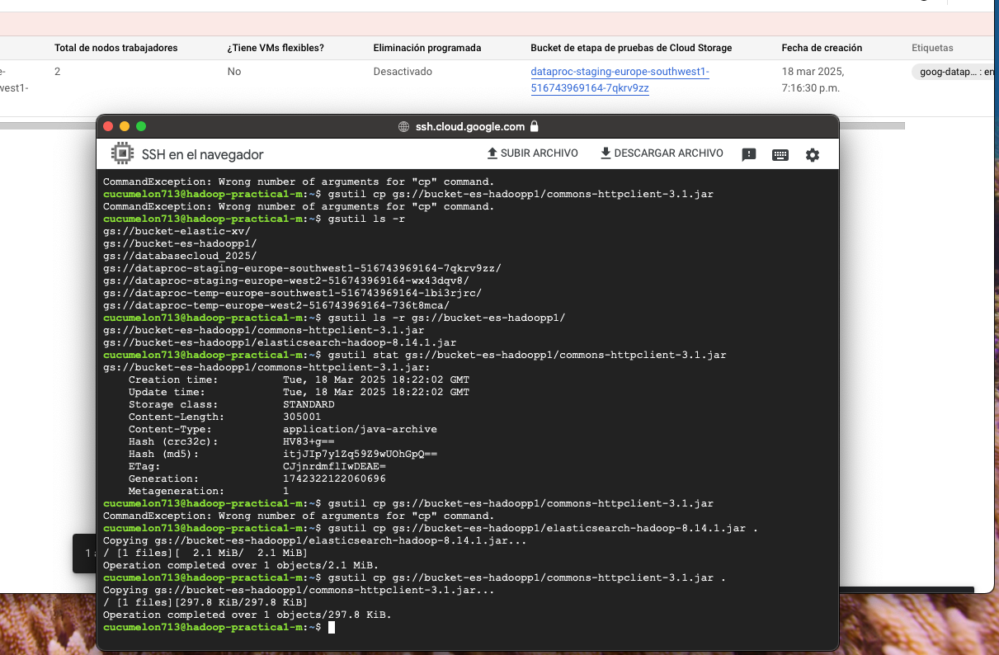

# Data-Arquitecture-Practica

In this repository, we will do an exercise in which we connect Hadoop with ElasticSearch. Specifically, we will establish a connection between Hive and an ElasticSearch index. At the end we can add a visuzlization dashboard in Kibana, to obtain a great potential of Obtention, processing and Big Data management.

Each one of the steps to do this, has a section in which a screenshot of the different configurations is shown.

PART 1 - Configuration ElasticSearch-Hadoop (ES-Hadoop)

Screenshot of SSH terminal from Hadoop cluster after Hadoop has been configured with elasticsearch-hadoop and commons-httpclient.

PART 2 - Configuration of ElasticSearch server
Screenshot of SSH terminal from ElasticSearch Instance where ElasticSearch has been configured.

PART 3 - Configuration in cluster Hadoop of connection with ES.
Screenshot of SSH terminal from Hadoop cluster to connect ES server with Hive.
PART 4 - Connecting Data
Screenshot of the Hadoop cluster console with the query result.

PART 5 - KIBANA
Screenshot of the Kibana console with a simple visualisation.

[Practica_Data_arquitecture.pdf](Practica_Data_arquitecture.pdf)